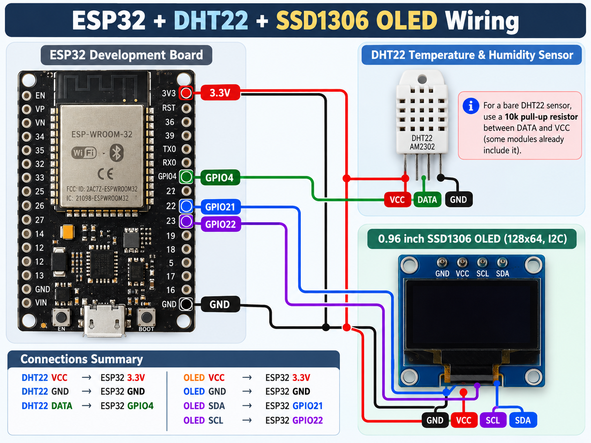

# ESP32 DHT22 OLED Monitor

یک پروژه ساده برای **اندازه‌گیری دما و رطوبت محیط با سنسور DHT22** و نمایش نتیجه روی نمایشگر **OLED SSD1306 (128×64)** با استفاده از **ESP32** و **Arduino IDE**.

## قابلیت‌ها

- خواندن دمای محیط (سانتی‌گراد) و رطوبت نسبی (درصد) از DHT22
- نمایش اطلاعات روی OLED از طریق ارتباط I2C
- چاپ مقادیر در Serial Monitor با نرخ `115200`
- نمایش پیام خطا در صورت نامعتبر بودن خواندن سنسور
- نمونه‌برداری دوره‌ای با تأخیر حدود `2.5` ثانیه بین خواندن‌ها

## قطعات موردنیاز

- برد ESP32 (با پایه‌های GPIO21، GPIO22 و GPIO4)
- سنسور DHT22 یا ماژول آماده DHT22
- نمایشگر OLED با کنترلر SSD1306، اندازه 0.96 اینچ، رزولوشن 128×64 و رابط I2C
- سیم جامپر و کابل USB مناسب برد
- در صورت استفاده از سنسور خام DHT22: مقاومت Pull-up حدود 10kΩ بین DATA و 3.3V (برخی ماژول‌ها آن را دارند)

## سیم‌کشی


### OLED SSD1306 (I2C)

| OLED | ESP32 |
|---|---|
| VCC | 3.3V |
| GND | GND |
| SDA | GPIO21 |
| SCL | GPIO22 |

### DHT22

| DHT22 | ESP32 |
|---|---|
| VCC | 3.3V |
| GND | GND |
| DATA | GPIO4 |

> همه قطعات باید **زمین مشترک (GND)** داشته باشند. ترتیب فیزیکی پایه‌های DHT22 خام را با نوشته‌ها/دیتاشیت همان قطعه بررسی کنید؛ جدول بالا نام سیگنال‌ها را نشان می‌دهد، نه شماره پایه‌ها.

## پیش‌نیازهای نرم‌افزاری

1. Arduino IDE و پکیج برد ESP32 را نصب کنید.
2. از بخش **Library Manager** کتابخانه‌های زیر را نصب کنید:
   - `Adafruit SSD1306`
   - `Adafruit GFX Library`
   - `DHT sensor library` (by Adafruit)
   - `Adafruit Unified Sensor` (وابستگی کتابخانه DHT؛ اگر خودکار نصب نشد)
3. کتابخانه `Wire` همراه هسته Arduino/ESP32 استفاده می‌شود.

## اجرای پروژه

1. فایل [ESP32_DHT22_OLED.ino](./ESP32_DHT22_OLED.ino)
   را در Arduino IDE باز کنید.

2. از منوی Tools → Board مدل برد ESP32
   خود را انتخاب کنید.
3. از منوی **Tools → Board** مدل سازگار با برد ESP32 خود را انتخاب کنید.
4. برد را با USB وصل کنید و از **Tools → Port** پورت صحیح را انتخاب کنید.
5. کد را **Upload** کنید.
6. **Serial Monitor** را روی `115200 baud` قرار دهید؛ دما و رطوبت روی OLED هم نمایش داده می‌شوند.

نمونه خروجی Serial Monitor (مقادیر صرفاً نمایشی هستند):

```text
Temperature: 24.5 C
Humidity: 48.2 %
```

## تنظیمات اصلی در کد

```cpp
#define SCREEN_WIDTH 128
#define SCREEN_HEIGHT 64
#define SCREEN_ADDRESS 0x3C
#define DHTPIN 4
#define DHTTYPE DHT22
```

و پین‌های I2C:

```cpp
Wire.begin(21, 22); // SDA, SCL
```

## رفع خطاهای رایج

- **`OLED not found!`**: تغذیه، سیم‌های SDA/SCL، زمین مشترک و آدرس I2C را بررسی کنید. مقدار `0x3C` مربوط به ماژول مورد استفاده در این کد است و ممکن است در نمایشگر دیگری متفاوت باشد.
- **`DHT22 reading failed!`**: اتصال DATA به GPIO4، تغذیه، مقاومت Pull-up (در صورت نیاز) و اتصال درست سنسور را بررسی کنید.
- **نمایش ندادن خروجی سریال**: نرخ Serial Monitor را روی `115200` تنظیم کنید و پورت صحیح را انتخاب کنید.
